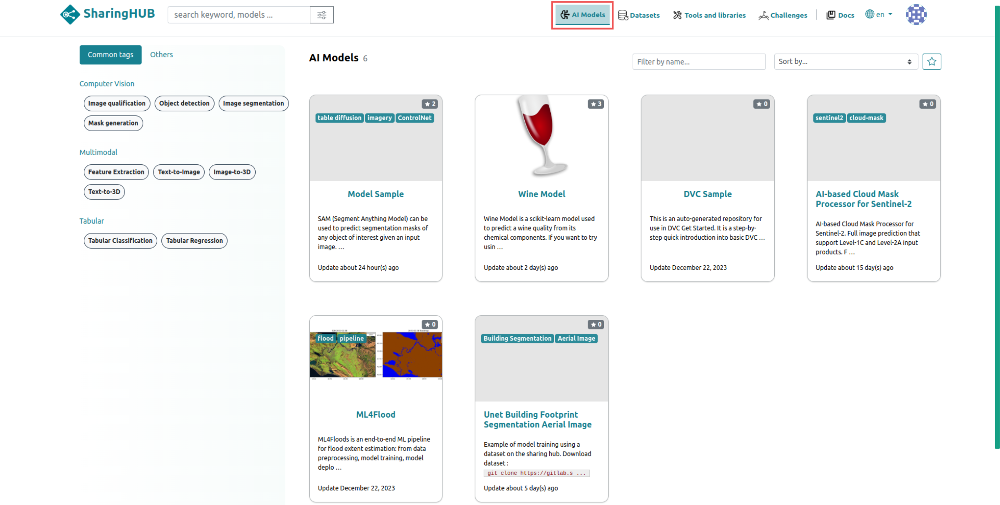
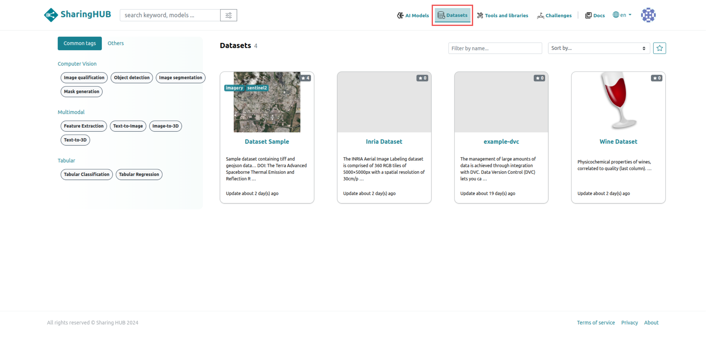
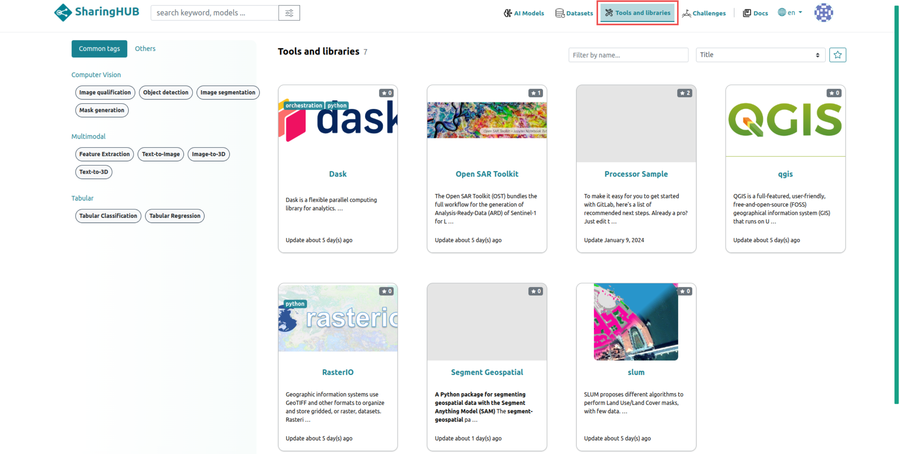
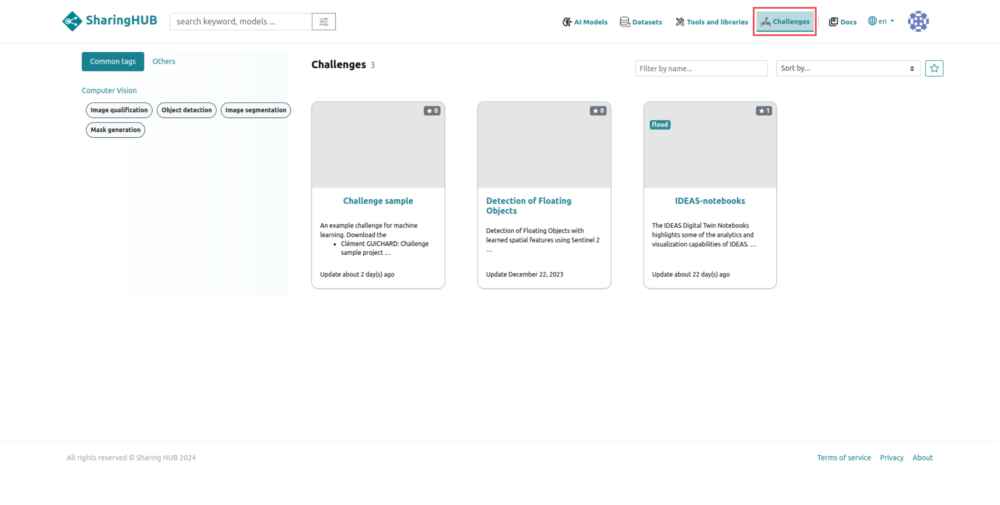

# Categories

The SharingHub is an online platform dedicated to sharing resources and tools in the field of artificial intelligence (AI). It offers users the possibility of sharing and accessing projects from several categories, including:

- AI model
- Dataset
- Tools and libraries
- Challenge

## AI Models

All projects related to the AI models category are served by the SharingHub in the AI models section, with collection_id: **ai-model** for STAC API.



Example get projects from AI model categories using the STAC API:

```bash
#!/bin/bash
curl https://sharinghub.p2.csgroup.space/stac/search?collections=ai-model&limit=100
```

## Datasets

Datasets are projects in the dataset category, generally repositories where large volumes of data are stored for your AI model training. These data repositories are compatible with git LFS and DVC, which ensures a large storage volume.

Datasets are served by the SharingHub in the Datasets section, with collection_id: **dataset** for STAC API.



## Tools and Librairies

Tools and libraries are projects in the processor category, generally containing external or internal libraries that you have written to improve the handling of your datasets, or to enhance the learning of your AI models.

All Tools and librairies are served by SharingHub in Tools and librairies section,  with collection_id: **processor** for STAC API.



## Challenge

Challenges are projects dealing with an issue that is constantly evolving. This enables developers and scientists to make multiple contributions.

All challenges are served by SharingHub in Challenges section,  with collection_id: **challenge** for STAC API.


