# Project view

The main sharingHub view, shown below, is designed to display as much metadata as possible about a project, whether it's an IA model, a dataset, a challenge or a challenge.

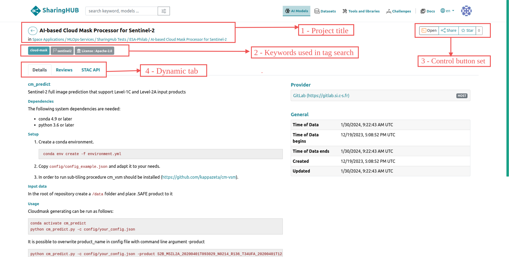

## 1. Project title Section

This section is made up of the project name as described in GitLab and a link that takes you directly to the repository where the project is hosted.

## 2. Keywords/Tags Section

This section displays all the keywords and licenses related to the project in GitLab. It's important because it's used as a label to filter out projects with common criteria or specifications. Moreover, tags are used to improve searches, as described in the [tag search section](../user_guide/search_overview.md#tag-search-tab).

## 3. Controls Button set

This important section allows you to interact with the project with the following functionalities:

### Open project in Jupyter Notebook
  
If the SharingHub is configured as a notebook service, this button will appear, allowing you to open the project, in particular your IA model in a notebook, for testing or manipulation in a dedicated environment.

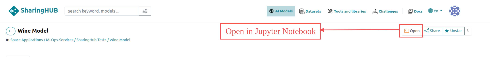

When you click the open button, the VRE is launched to open the notebook environment.

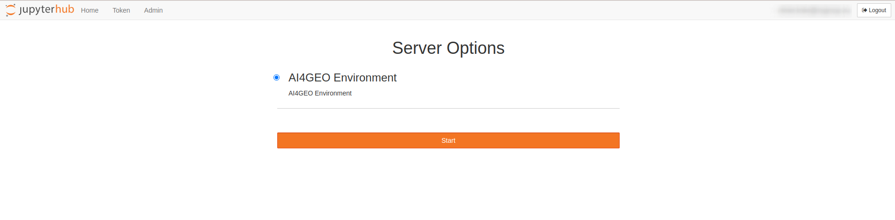

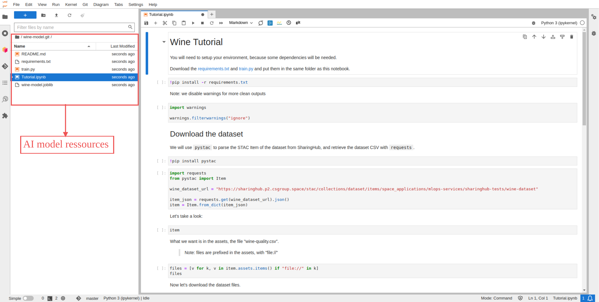

### Display DVC information

The DVC service enables you to store large volumes of data. The DVC button is therefore only displayed for projects in the "Datasets" category, which have a DVC configuration in the project resources.  This button displays the remote DVC configuration link and additional information on the DVC [documentation](https://dvc.org/doc) and [tutorial](../tutorials/manage_dataset_with_dvc.md).

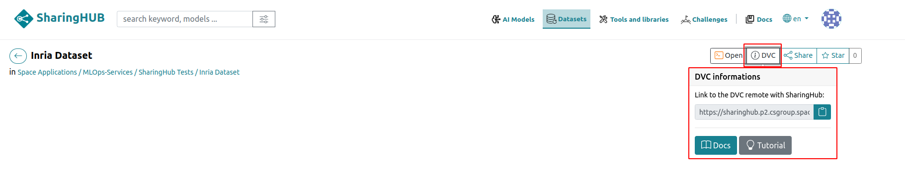

### Share the project
  
The share button lets you share the direct link to the project with other colleagues.

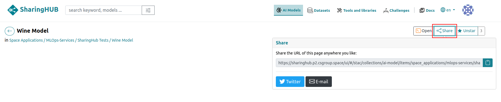
  
### Star the project
  
If you like the project, you will be able to star it and it will appear in your [favorite projects](../user_guide//search_overview.md#filter-by-starred-project).

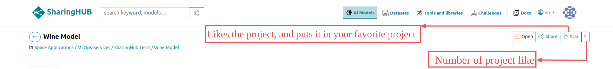
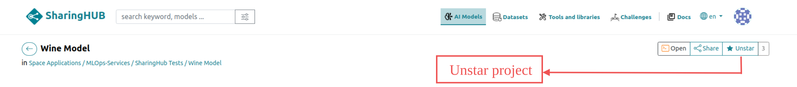

!!! Note Warning

    If the default token is enabled, you won't see this display because it's read-only access.

    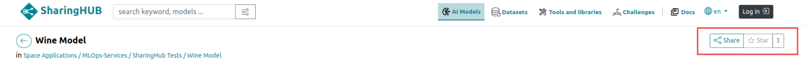

## 4. Dynamics Tabs

This section displays details, comments and the STAC API in tabbed format.

### Details Tab

This "details" tab displays the project description first. This view highlights all the project's files and resources in the "assets" section, and thanks to the "additional resources" section it's possible to see references to other projects or resources.

In some cases, and more generally for datasets, the details tab may show a map with an area corresponding to the geographic area of the dataset.

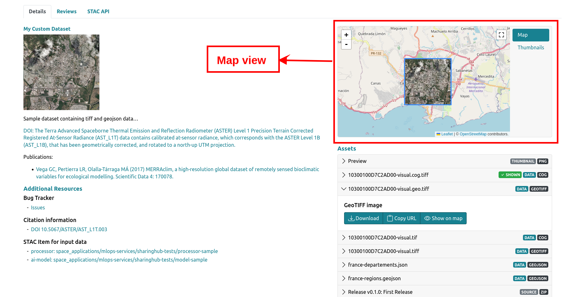

### Reviews Tab

This section is a discussion forum for the project, allowing contributors to leave notes and ask each other questions.

### STAC API Tab

This section shows the STAC API information of the project, the link to the STAC file of the project and also checks if the project is valid according to the supported extensions.

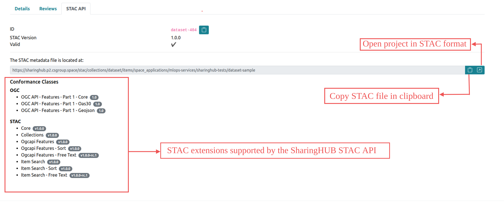