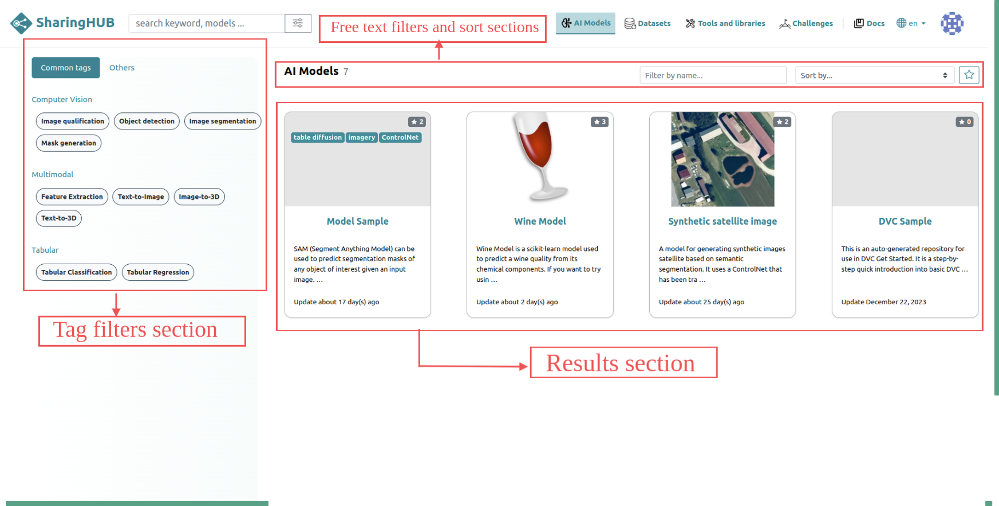
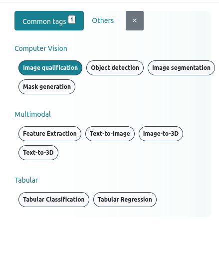
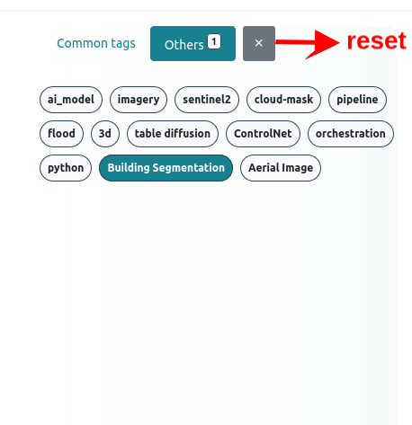
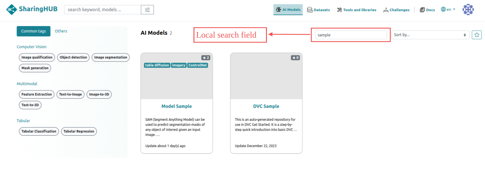
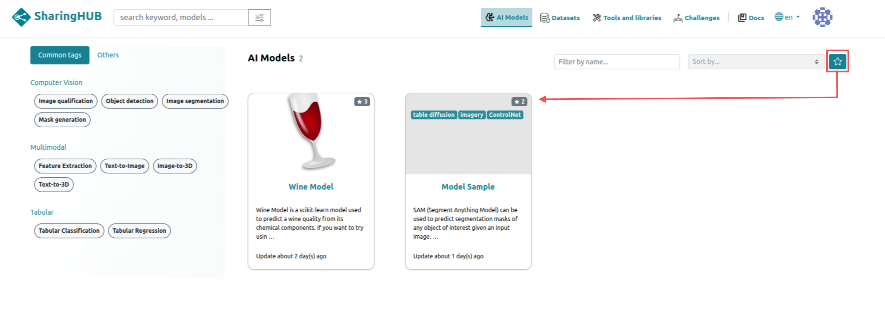
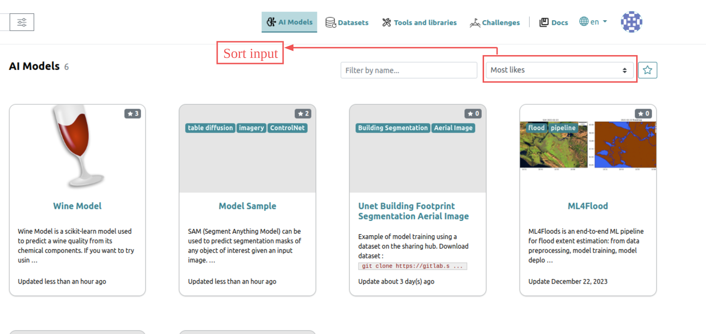
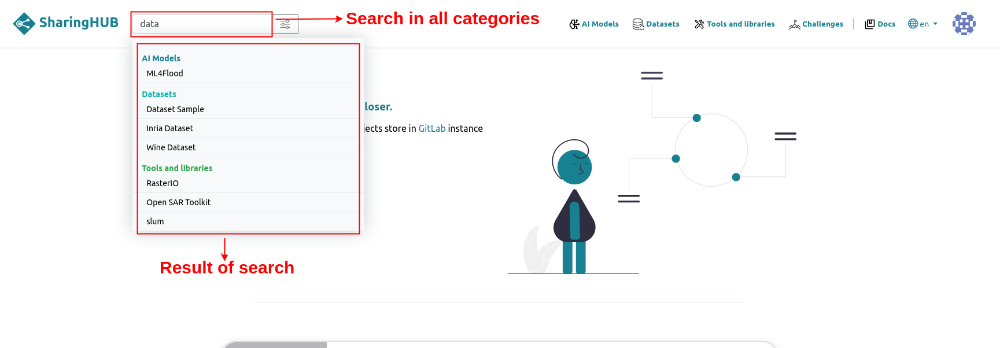
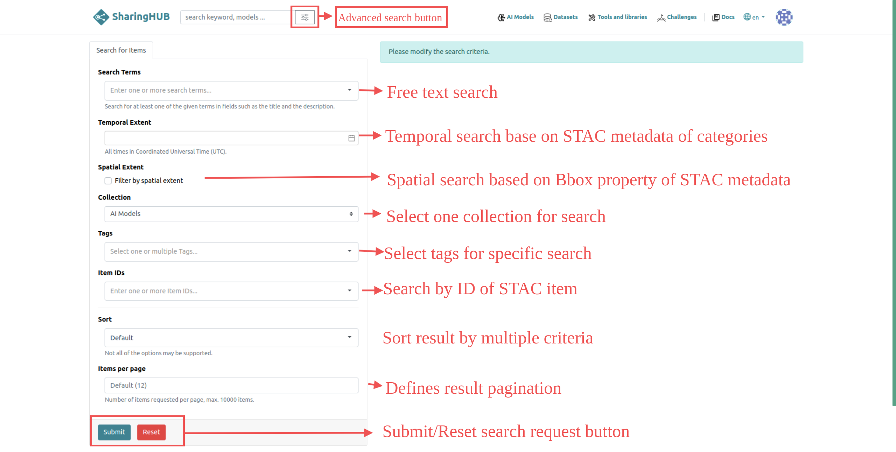

# Search

SharingHub is a platform packed with AI models, Datasets, Libraries and tools, Challenges.

Everything you need for your machine learning projects.

## Tag search tab

In the category view, it's possible to search for projects by specific tag to target your search.
There are two types of tags: **common tags**, which refer to the most commonly used tags in the field, and **other tags**, which refer to tags associated with projects in the gitlab connected to SharingHub.

<figure style="float:left;width:50%; height:400px"  markdown>

</figure>
<figure style="float:right;width:50%;height:400px"   markdown>

</figure>

## Filter by title

Search by title allows you to search in the category where you are a project by project name.

## Filter by starred project

As the categories shown are projects stored on gitlab, you can display only the projects you like using the button below.

If you wish to remove this filtering, click on the button again to deactivate the filtering.

## Sort Item

In addition to filtering, it is also possible to sort results to optimize visualization. The following criteria are available for filtering:

- Recently created projects,
- Recently modified projects,
- Most popular projects (by number of likes).
- You can also sort them in ascending alphabetical order to facilitate your search.

## Search Anywhere

## Advanced Search

Sometimes, you may want to perform complex or more precise searches. The "advanced search" view provides a richer interface for your searches.

