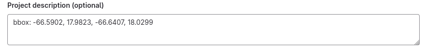

# Common Metadata

We rely on user-defined metadata to pass information to SharingHub. The metadata are always handled the same way, regardless of the project's category, although some of them are more suited for specific categories.

## Syntax

The metadata of a project are defined in its README file. Markdown allows a syntax for metadata, as YAML:

```md title="README.md" hl_lines="1-3"
---
foo: bar
---

# Title

Lorem ipsum dolor sit amet, consectetur adipiscing elit. Morbi neque neque,
malesuada vel sodales eu, pharetra sit amet nibh. Integer in nunc ante.
Morbi commodo metus est, id aliquet odio cursus id. Ut non sagittis metus.
```

By using a `---` delimited section at the start of your `README.md`, you can write metadata that will not be rendered in the project description on SharingHub. The informations here will be parsed and used to process the STAC Item of the project.

## Rendering

Our metadata schema relies a lot on STAC, but some helpers are available. All metadata are written inside the `---` section.

### Title

The title defaults to the project name, but you can easily override it with the `title` metadata.

```yaml title="Metadata example"
title: My Custom Title
```

### Preview

The preview can be auto-discovered in the README, if your image "alt" is "Preview" (not case-sensitive).

```md title="README.md"

```

Or, you can define it in the metadata.

```yaml title="Metadata"
preview: <url>
```

### License

We can retrieve the license if you have a LICENSE file in your repository, it will be automatically detected. However, it can still be configured.

```yaml title="Metadata"
license: <license name>
```

!!! warning

    Only a [SPDX License Identifier](https://spdx.org/licenses/) is allowed.

In addition, you can set an URL for the license. While it is automatically set to the URL of the project LICENSE file, or determined from the license given, you can also change it:

```yaml title="Metadata"
license-url: <license url>
```

!!! warning

    The STAC Item specification indicates that the URL of the license **SHOULD** be defined.

### Extent

By default, a project temporal extent starts at the creation date of the gitlab repository, and ends at the date of last activity in this repository. But we do have search capabilities on datetime range, so you may want sometime to correct your project temporal extent. Do so with:

```yaml title="Metadata example" hl_lines="2"
extent:
  temporal: ["2023-11-01T12:00:00.0", "2024-01-01T12:00:00.0"]
```

!!! info

    Datetime should be UTC.

As for spatial extent, the current way of defining it with search capabilities is in the project description in the General Settings.



We only work with bbox for now, but the usage of complex geometries with WKT is planned.

### Providers

The provider concept in STAC help to inform about the organizations capturing, producing, processing, hosting or publishing the data of the project.

By default, the "host" provider is set to the project GitLab URL, and the "producer" provider is set to the gitlab repository user or first-level group.

Example: for `https://gitlab.example.com/A/repo-b` with the user "A" having a repository "repo-b", the host is `https://gitlab.example.com/A/repo-b`, and the producer is `https://gitlab.example.com/A`.

However, you can still pass your own values for the providers. You must follow the [spec](https://github.com/radiantearth/stac-spec/blob/master/item-spec/common-metadata.md#provider) of the provider object.

```yaml title="Metadata"
providers:
  - name: <producer name>
    roles: ["producer"]
    url: <producer url>
  - name: <host name>
    roles: ["host"]
    url: <host url>
```

### Links

#### Related projects

You may want to add links to your projects. A common use-case would be linking an AI model to a dataset. You can link projects between them with the `related` metadata, but beware, in SharingHub projects are categorized, and you will need to use that information. SharingHub categories are STAC collections, you will have to use the collection id (example: ai-model, dataset).

```yaml title="Metadata"
related:
  <collection id>: <gitlab project url>
```

List are also accepted for multiple links

```yaml title="Metadata"
related:
  <collection id>:
    - <gitlab project 1 url>
    - <gitlab project 2 url>
```

#### Raw links

You can also use a more "low-level" metadata to directly define additional STAC links with `links` metadata. Follow the [spec](https://github.com/radiantearth/stac-spec/blob/master/item-spec/item-spec.md#link-object).

```yaml title="Metadata"
links:
  - href: <url>
    rel: <rel>
```

!!! tip

    Check [Helpers](#helpers) to learn some extra features for the link's `href`.

### Assets

#### Files

The most basic asset you will want to share is a file of your gitlab repository. Files can be selected to be assets in SharingHub.

```yaml title="Metadata"
files:
- <pattern>
```

We work with a system of rules, with patterns using the same syntax as most unix systems. Path are relative to the project root. You may add a file by writing him plainly

```yaml title="Metadata example"
files:
- myfile.txt
```

Or use glob syntax

```yaml title="Metadata example"
files:
- "*.txt"
```

The above solution will include all files ending with ".txt".

There's also a more custom rule syntax that you may use. It is possible to "cast" files for other media types than the one detected with the file extension.

Declare a PyTorch weight file as a zip for example:

```yaml title="Metadata example"
files:
- zip://*.pt
```

It can be read `<cast>://<pattern>`. Casts available: text, json, xml, yaml, zip, geotiff, cog, geojson, compose, notebook.

You can also cast by file extension:

```yaml title="Metadata example"
files:
- tiff=geotiff
```

The above rule is equals to `geotiff://*.tiff`.

!!! note

    You may have no rule defined for your files and still see them in SharingHub, this is because there are default rules configured on your SharingHub instance.

#### Raw assets

In addition to these assets, you may want to declare assets with, again, a low-level control to use the full capabilities of STAC. You can do it with the `assets` metadata. As described in [STAC Concepts](../stac-concepts.md#assets) it is, unlike links, a mapping.

```yaml title="Metadata"
assets:
  <asset key>:
    href: <asset url>
    title: <asset title>
    roles: [<asset role>, ...]
    type: <asset media type>
```

Because it's a mapping, it is important to note that you can alter an existing asset. The [files assets](#files) are generated, but you may want to modify them, most common case is changing the title, or add a role demanded by a STAC Extension. Files assets are defined with the file path as key, allowing you to do this:

```yaml title="Metadata example"
files:
- "*.txt"
assets:
  myfile.txt:
    title: MyFile
    roles: ["test"]
```

It is important to note that you can override `href`, `title` and `type`, but the `roles` are extended. The default role is "data", and the modification above will preserve it, with now `roles: ["data", "test"]`

!!! tip

    Check [Helpers](#helpers) to learn some extra features for the asset's `href`.

### Extensions

We rely on STAC Extensions to enrich our metadata. You can use about every STAC extension you want like this:

```yaml title="Metadata"
extensions:
  <extension prefix>: <extension schema>

<extension prefix>:
  <prop>: <val>
```

A concrete example for the Scientific Citation Extension:

```yaml title="Metadata example"
extensions:
  sci: https://stac-extensions.github.io/scientific/v1.0.0/schema.json

sci:
  doi: 10.XXXX/XXXXX
  citation: Lorem ipsum dolor sit amet, consectetur adipiscing elit.
```

You may have noticed that in STAC Extensions the properties are used like "sci:doi", "sci:citation", and you are right, but the syntax above help to avoid having to type multiple times the prefix of the extension.

!!! note

    Your SharingHub instance may have some STAC Extensions pre-configured, with no need to specify them in `extensions` metadata.

#### Scientific Citation

This extension is built-in in STAC Browser with an interesting parsing capability. You can define their values like in the example above, or write them in your README directly.

```md title="README.md"
[DOI: Lorem ipsum dolor sit amet, consectetur adipiscing elit.](https://doi.org/10.XXXX/XXXXX)
```

If a markdown link href starts with `https://doi.org`, it will be retrieved as the DOI. If more than one link matches this condition, the first is still the project DOI, and the remaining DOIs will be added as publications, following the extension.

### Remaining properties

After every metadata described in the previous sections are processed, there may still remain other metadata. These metadata are passed as-is to the STAC Item **properties**.

For example, you may want declare the `gsd` or `platform` of a Sentinel 2 dataset:

```yaml title="Metadata example"
gsd: 10
platform: sentinel-2
```

These metadata will be passed as properties transparently.

```json title="Generated STAC Item"
{
  ...
  "properties": {
    ...
    "gsd": 10,
    "platform": "sentinel-2",
    ...
  }
  ...
}
```

### Helpers

Both [Links](#links) and [Assets](#assets) declare a `href` field, an URL to a resource. But, there are two cases where you don't have direct URL to the resource.

#### Repository file

If an href is detected to be a "local path", like "./myfile.txt" or "files/myfile.txt", the `href` is automatically changed to an URL using our download API for the file.

#### Other project

The `href` should never be a hard link to a SharingHub instance, and you may not want to use the [`related`](#related-projects) metadata in some cases. You can still generate an URL to the STAC Item of another project without hard linking the SharingHub instance.

Because a project's STAC Item is always in a collection (our [categories](../../../explore/categories.md)), you will need the "collection id" / category of the target project, and you can use the following syntax:

```yaml title="Metadata"
href: <collection id>+<gitlab project url>
```

A more concrete example:

```yaml title="Metadata example"
href: dataset+https://gitlab.si.c-s.fr/space_applications/mlops-services/sharinghub-tests/dataset-sample
```

In SharingHub, an URL to the STAC Item will then be created.
